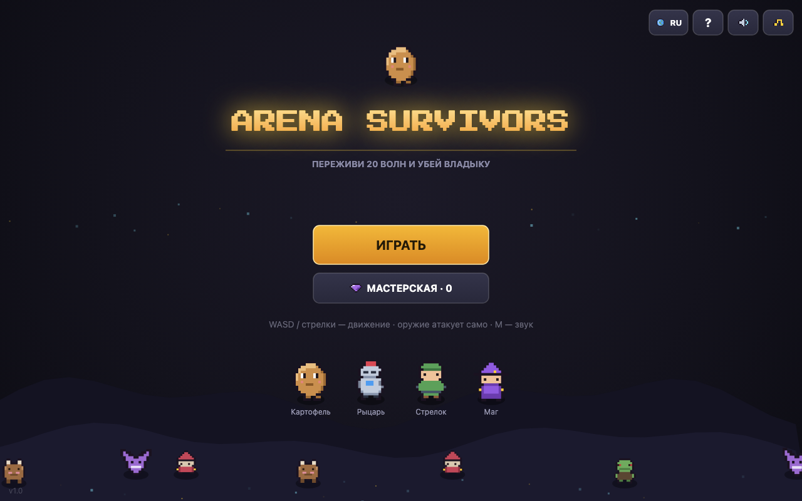
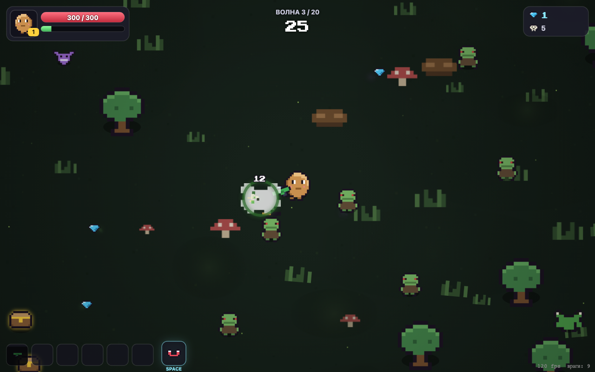
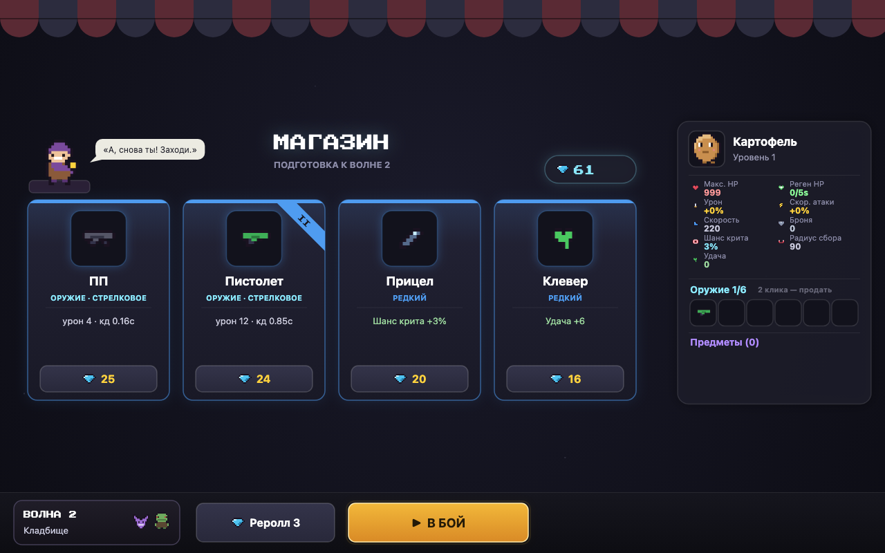
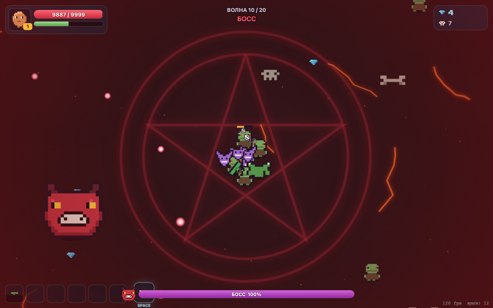

# 🥔 Arena Survivors

A pixel-art arena survival roguelite in the browser. Survive 20 waves, build your loadout of weapons and items, take down four bosses — then push your luck in endless mode.

**[▶ Play](https://danilaigoshin.github.io/arena-survivors/)** · Controls: WASD / arrows · Esc — pause · M — sound · Touch supported



## Features

- **20-wave campaign** across 10 unique maps: meadows, graveyard, glacier, cinders, demon's lair… — each with its own palette, obstacles and atmosphere
- **Weapons fire on their own** — your job is positioning and dodging
- **Shop between waves**: weapon tiers I–IV by merging duplicates, selling, item rarities, a wandering trader with discounts
- **Evolutions**: a tier-IV weapon + a catalyst item = a unique superweapon (Annihilator, Storm Blade…)
- **4 heroes** with different starts and tradeoffs, 2 unlockable with shards
- **Meta progression**: shards from runs, permanent perks, weapon unlocks, records
- **Elite enemies, multi-phase bosses at waves 5/10/15/20, endless mode** after victory
- **3 difficulty levels** and **8 interface languages**
- Pixel art, animation and synthesized sound — everything drawn and generated in code, zero external assets





## Tech

- **TypeScript + HTML5 Canvas 2D**, the only dependency is Vite
- Fixed 60 Hz timestep, object pools, spatial grid — 300 enemies at 120 fps
- Sprites are text-based pixel grids baked into offscreen canvases
- Sound is WebAudio synthesis (no audio files), saves live in localStorage

## Run locally

```bash
npm install
npm run dev      # http://localhost:5173
npm run build    # production build in dist/
```

---

Built in tandem with [Claude Code](https://claude.com/claude-code).
